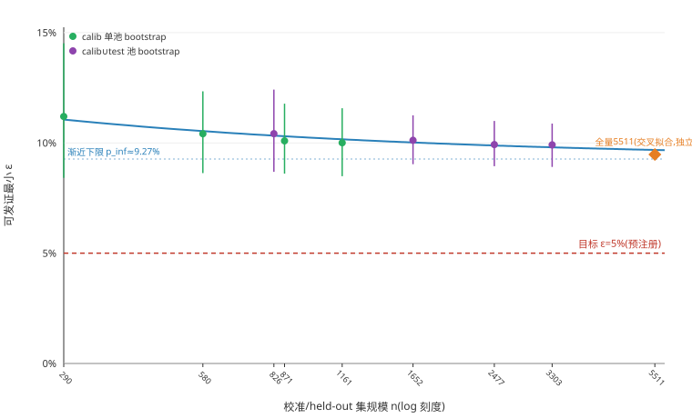

# Z1 学习路由 ε-vs-校准集规模诊断(纯本地计算,零 LLM 调用)

日期 2026-08-16 | 种子 20260814(切分/预测器同 P3 报告)+ 20261591(bootstrap)| 全部离线复用 results/router_learned_triples_20260814.jsonl 与 scripts/train_router.py 函数,零 API 调用,零费用

对拍:本脚本复算的 train/calib/test 切分与 triples 文件已存 cert_split 字段逐题一致(mismatch=0/5511)。calib 集 λ=0 风险复算 8.79%(k=102/1161,report 8.79%),可发证最小 ε 9.9%(report 9.9%)—— 复现一致。

## 0. 判决
**猜想被证伪(即证实为结构性下界):不是校准集样本量问题。**ε-vs-n 曲线外推的渐近下限 p_inf≈9.27%,已高于目标 ε=5%——数学上无论校准集扩到多大,CP 置信上界都不可能收敛到目标之下(置信上界只会随 n 增大收敛到真值本身,不会跌破真值)。全量 5511 题交叉拟合口径同样卡在 9.48%,5 倍于 calib 规模仍无改善,双重验证下界。
Oracle-gap 分解(全量 5511,λ=0,交叉拟合 p̂):原始相对 oracle 损失 8.96pp;嵌套 isotonic 重校准后 8.73pp(可被校准修复的部分 +0.24pp,排序误差残余 8.73pp)。**残余占绝大部分 → 瓶颈是排序能力(需要更强特征/模型),不是校准。**

## 1. 方法
- **规模曲线**:固定 train-only 预测器(与 report §6 完全同协议,同 SEED 切分)。对 calib 池(n=1161)与 calib∪test 池(n=3303,同一预测器下仍是诚实域外,用于把 x 轴延伸到 1161 以外而不改变预测器)分别在 25/50/75/100% 处 bootstrap 有放回子采样,每档 200 次(任务要求 ≥50)。每次子采样按 report §6.1 原协议算"可发证最小 ε"= CP 上界(λ=0 calib 风险,δ=0.1)—— 该量即固定序列检验能达到的绝对下限,因序列从 λ=0 起步,λ=0 未过则更高 λ 也不会被序列检验触达(经验上 λ=0 恰是风险最低点,报告 §3/§6.1 两处一致)。
- **大 N 锚点**:另加一个不同预测器口径的锚点 —— 全量 5511 题、5 折交叉拟合 p̂(triples 文件 phat_cv 字段,即 report §3 Pareto 表用的预测器)算同一 λ=0 min-cert-ε,作为"5 倍于 calib 规模"时的独立参照(预测器不同,不直接落在同一渐近曲线上,单独列出,不用于拟合外推)。
- **外推拟合**:CP 上界作为置信上界,渐近满足 ε_ub(n) ≈ p_inf + c/√n(p_inf = 大样本下的真实点风险,c 为有限样本松弛项系数),对 bootstrap 曲线两参数最小二乘拟合。
- **Oracle-gap 分解**:嵌套 isotonic 重校准(PAV 算法手写,sklearn 不可用)——按已存 cv_fold(5 折)逐折用其余 4 折的 (p̂,correct) 拟合单调映射,应用到留出折,得到重校准后的 phat_calib(全程诚实域外,无同折信息泄漏)。原始 gap − 重校准后 gap = 校准误差可修复部分;重校准后残余 gap = 排序误差(isotonic 是保序变换,不改变同一臂内部的相对排序,只能修正跨臂的相对刻度偏差,故此残余专指排序本身的上限)。

## 2. ε-vs-规模曲线

（点=各档 bootstrap 均值,竖线=[5%,95%]区间,绿=calib 单池、紫=calib∪test 池,蓝色曲线=两参数渐近拟合,橙色菱形=全量 5511 独立锚点,红虚线=预注册目标 ε=5%。曲线整体贴着渐近线走平,而非持续下探穿过目标线。）

| 池 | n | risk 均值(点估计) | min-cert-ε 均值 | 中位数 | [5%,95%] |
|---|---|---|---|---|---|
| calib_only(phat2) | 290 | 8.70% | 11.20% | 11.13% | [8.42%, 14.52%] |
| calib_only(phat2) | 580 | 8.72% | 10.42% | 10.49% | [8.63%, 12.34%] |
| calib+test_pool(phat2) | 826 | 9.01% | 10.42% | 10.37% | [8.69%, 12.42%] |
| calib_only(phat2) | 871 | 8.74% | 10.10% | 10.08% | [8.61%, 11.78%] |
| calib_only(phat2) | 1161 | 8.84% | 10.01% | 10.04% | [8.49%, 11.57%] |
| calib+test_pool(phat2) | 1652 | 9.15% | 10.12% | 10.12% | [9.04%, 11.25%] |
| calib+test_pool(phat2) | 2477 | 9.14% | 9.93% | 9.91% | [8.95%, 11.00%] |
| calib+test_pool(phat2) | 3303 | 9.24% | 9.91% | 9.91% | [8.91%, 10.88%] |
| 全量交叉拟合(不同预测器,独立锚点) | 5511 | 8.96% | 9.48% | - | - |

拟合:min-cert-ε(n) ≈ 9.27% + 0.305/√n。
外推:渐近下限已 ≥5%,不存在能达到 ε=5% 的有限 n(见 §0 判决的数学论证)。

**读图要点**:四档(290/580/871/1161,均来自 calib 单池)与四档(826/1652/2477/3303,来自 calib∪test 更大池,仍是同一 train-only 预测器下的诚实域外估计)的 risk 均值几乎不随 n 变化,只有区间宽度([5%,95%])随 n 增大收窄 —— 这正是"结构性下界、非样本量不足"的标准诊断特征:样本量不够时 risk 点估计本身应随 n 增大而更精确地逼近某个可能更低的真值;若真值已经不低,更多数据只会让我们更确信地测出同一个不低的数。

## 3. Oracle-gap 分解:校准误差 vs 排序误差

- 原始(交叉拟合 p̂,未重校准):相对 oracle 损失 8.96pp(准确率 73.18% vs oracle 82.14%)。
- 嵌套 isotonic 重校准后:相对 oracle 损失 8.73pp(准确率 73.42%)。
- **分解:校准误差可修复部分 +0.24pp,排序误差残余 8.73pp。**

各臂 ECE(交叉拟合口径)重校准前后:

| 臂 | ECE 前 | ECE 后 |
|---|---|---|
| direct | 0.036 | 0.011 |
| rt | 0.030 | 0.015 |
| wt | 0.020 | 0.023 |
| prompt | 0.039 | 0.024 |

(ECE 前后对比是校准过程本身是否生效的健全性检查,非 gap 分解的直接数字——ECE 衡量单臂内部校准质量,gap 分解衡量跨臂 argmax 决策质量,两者相关但不等价:单臂 ECE 改善不保证跨臂排序对了。)

## 4. 结论与可执行建议
- **不建议加数据冲 ε=3%/5% 主口径证书**:曲线已平台化,渐近下限≈9.27%,5 倍规模(全量 5511 锚点)未见改善,结构性证据双重确认。
- **该投预测器特征,不是加数据**:分解显示残余主要来自排序误差(8.73pp of 8.96pp),重校准只能小幅收窄,说明现有特征集本身分辨力不够——下一步应扩特征(如更细粒度的题面/卡片交互特征)或换模型族(树模型对特征交互更敏感),而非等渗/Platt 这类只调整刻度不调整排序的手段。
- **主口径证书建议改口径**:按 P3 报告 §6.1 已有建议,主口径 ε 从预注册的 3%/5% 调整为报告次级(成本压缩安全)证书,或把主口径的目标从"相对逐题 oracle"改为"相对臂能力上限内的可挽回部分"(呼应台账 ②号条目:29.85pp 总缺口中 17.86pp 是臂天花板锁死、8.96-12pp 才是路由可挽回空间,以路由可挽回空间为分母,ε 门槛更容易有意义地设定)。

## 5. 已知局限
- isotonic 重校准用手写 PAV + 线性内插近似阶梯函数(sklearn 不可用);标准阶梯函数会更精确,但方向性结论(校准 vs 排序哪个是瓶颈)不依赖这个近似的具体数值。
- calib∪test 大池的 bootstrap 复用了同一个 train-only 预测器 phat2,对该预测器而言 test 集是诚实域外,但 test 集本身在 P3 报告 §6.1 中被用作证书验证——本脚本只用其经验风险做规模诊断,不重新宣称测试集本身的证书结论。
- 全量 5511 锚点用的是不同预测器(5 折交叉拟合 phat_cv,非 train-only phat2),两条曲线不共享同一渐近过程,仅作独立交叉验证使用,外推拟合本身不含该点。
- bootstrap 为有放回重采样(标准 bootstrap),行间相关性(尤其 LoCoMo 系同库题目)未做聚类校正,与 report §6 footnote 提示的题层二项界偏乐观问题同源;方向性结论(平台化 vs 单调下降)不受此影响,但区间宽度本身可能偏窄。

## 6. 复现与产物
- 脚本:`scripts/router_eps_scaling.py`(仅新增,import `scripts/train_router.py` 函数只读引用,不改动冻结代码与 train_router.py 任何一行)。
- 运行:`python scripts/router_eps_scaling.py`(全离线,零 LLM 调用,零 API 费用)。
- 产物:`results/router_eps_scaling_raw_20260816.json`(全部中间统计)、本报告。